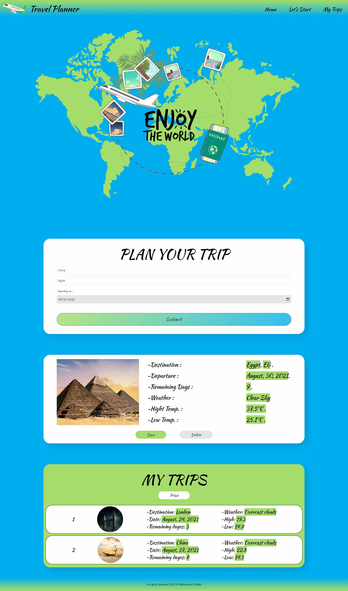

## Project Overview
This is the Capstone Project in Udacity's Front End Development Nanodegree.
This project is a web tool that aims to help users plan for their trips and get the required information about the destination 
like weather and an image of the location using information obtained from external APIs. 
_____________________________________________________________________________________________________________
## Tech stack

  
  

  
  
  
  
  

## Project Preview  
 
